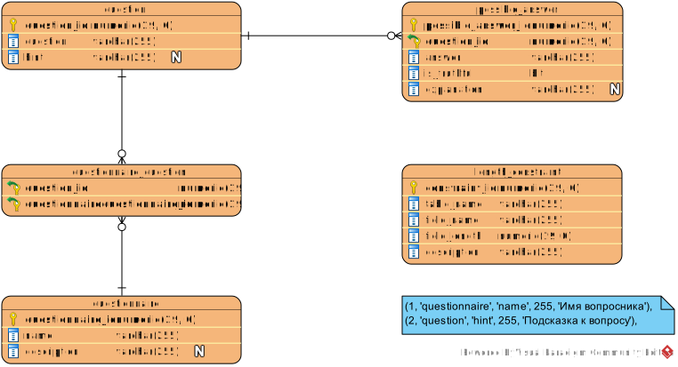

# BookReaderMaestro_2.0

Full-stack приложение для проверки знаний пользователей после прочтения глав технической литературы

## MVP

> MVP - Минимально жизнеспособный продукт (Minimum Viable Product)

Ключевая задача приложения оденивать знания пользователей после прочтения технической книги или главы из книги.  

Поэтому MVP представляется обладает минимальным набором сущностей: 
1. Опросный лист (questionnaire)
2. Вопрос (question)
3. Вариант ответа (possible_answer)

## Technology stack

### Frontend

React JS

### Backend

Java 8

Spring Boot 2.0

	+ JPA
	+ MVC
	+ Security

Maven

Lombok

### Relational Database Management System

Postgres SQL 12

## Tools

Инструмент                                             | Описание
-------------------------------------------------------|--------------------------------------------------------------------------------
[IntelliJ IDEA](https://www.jetbrains.com/ru-ru/idea/) | Интегрированная среда разработки программного обеспечения для Java
[Git](https://git-scm.com/)                            | Распределённая система управления версиями
[DBeaver](https://dbeaver.com/)                        | Платформенно-независимый клиент баз данных, написан на Java, работает с любой системой управления базами данных, поддерживающей JDBC 2.0, ODBC, REST.
[Visual Paradigm](https://www.visual-paradigm.com/)    | Инструмент UML CASE, поддерживающий UML 2, SysML и нотацию моделирования бизнес-процессов из группы управления объектами.
[Postman](https://www.postman.com/)                    |  Postman предназначен для проверки запросов с клиента на сервер и получения ответа от бэкенда.

## Teaching material

[Как спроектировать базу данных в Visual Paradigm](https://www.visual-paradigm.com/tutorials/how-to-model-relational-database-with-erd.jsp)
